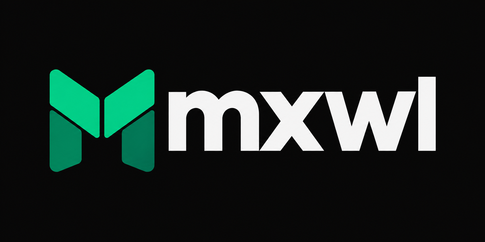
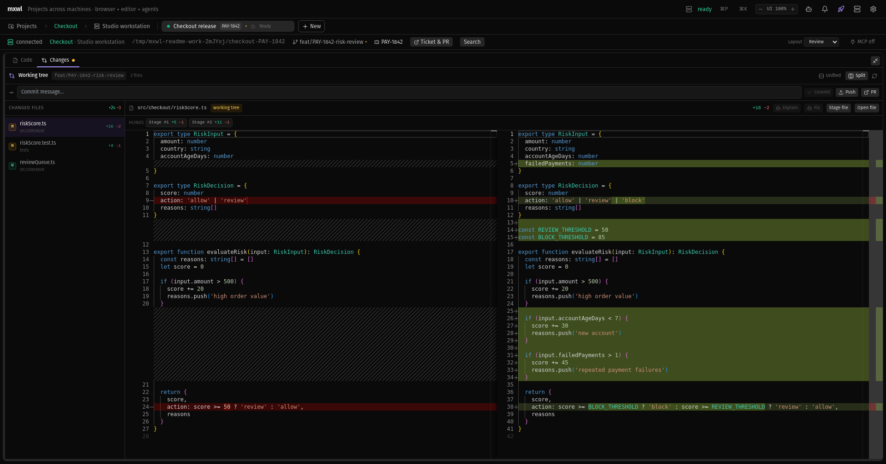
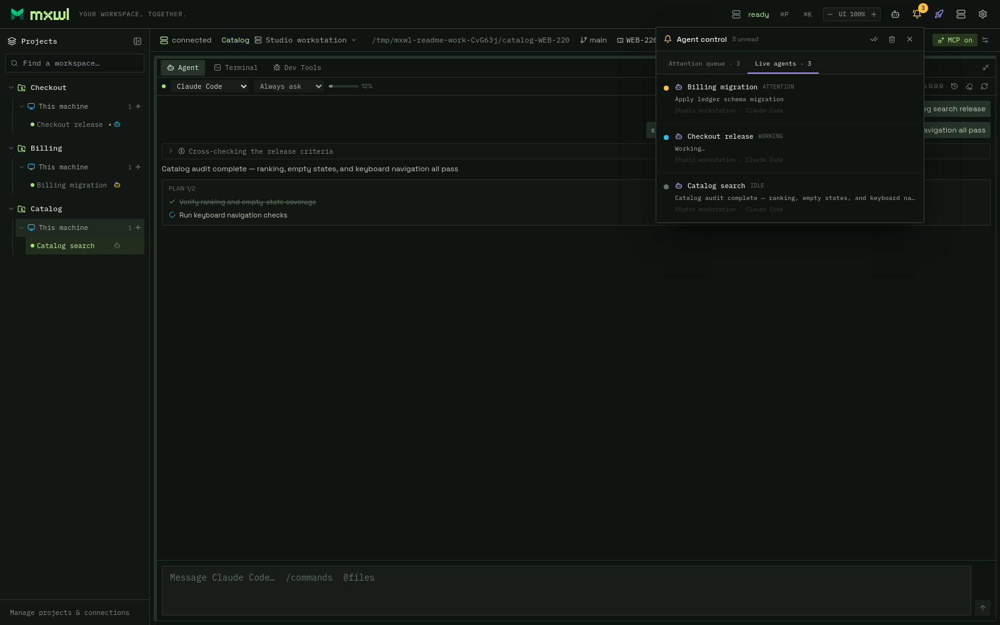
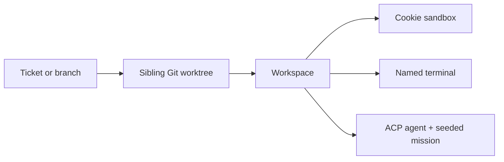
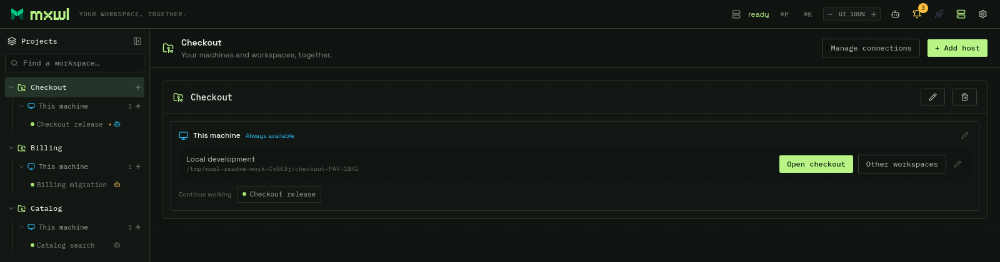
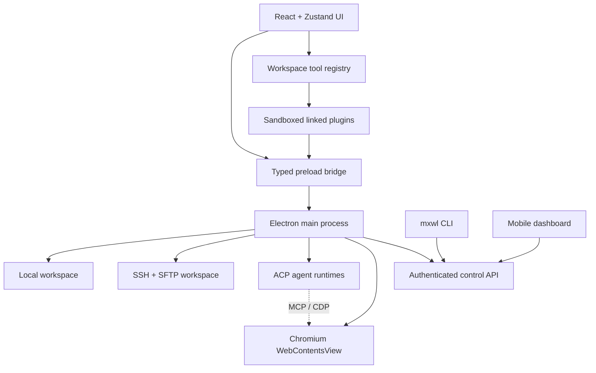

<div align="center">



**The agent command center for local and remote workspaces.**

Browser, code review, terminals, services, and coding agents—locked to the same folder.

[](https://github.com/KerryRitter/mxwl-editor/releases) [](https://github.com/KerryRitter/mxwl-editor/actions/workflows/ci.yml) [](./LICENSE) [](#install) [](#install)

[Install](#install) · [See what it does](#one-folder-one-command-center) · [Control your agents](#run-the-fleet-not-just-one-chat) · [Docs](#docs) · [Latest release](https://github.com/KerryRitter/mxwl-editor/releases/tag/v0.2.0-alpha.5)

</div>

> [!IMPORTANT]
> mxwl is an early alpha. Start on a non-production machine and read the [current limitations](./ALPHA.md) before rolling it out to a team.

## Product tour

### Review the working tree without leaving the cockpit

[](./docs/assets/mxwl-review.png)

<p align="center"><sub><strong>Changes</strong> — every changed file, unified or split diffs, hunk staging, commit, push, PR, and agent handoff.</sub></p>

### Know which agent needs you

[](./docs/assets/mxwl-agent-fleet.png)

<p align="center"><sub><strong>Agent control</strong> — one attention queue and live fleet across local and SSH workspaces.</sub></p>

<p align="center"><sub>Captured from the real app with reproducible demo workspaces. No UI mockups.</sub></p>

## Why mxwl exists

Modern development rarely lives in one editor window. A ticket may need its own worktree, authenticated browser session, dev server, terminals, pull-request review, and one or more coding agents. The hard part is keeping all of that context together—especially across SSH hosts, app restarts, and several tickets in flight.

mxwl makes the **folder the unit of work**. Open a repository, worktree, or ticket folder once and get a complete, isolated cockpit around it.

```text
myapp-PROJ-42/
├── browser       isolated cookies, tabs, DevTools, CDP
├── code          local or SFTP files in CodeMirror 6
├── changes       PR-style unified/split diffs and Git actions
├── terminals     PTYs, named tabs, optional tmux persistence
├── agent         Claude, Codex, Cursor, Gemini, and more via ACP
└── context       branch, ticket, services, links, history, layout
```

It is built for developers who run several worktrees, supervise coding agents, work on remote boxes, test multiple browser identities, or simply want to stop rebuilding their setup every time they change tickets.

## Where mxwl fits

These tools overlap, but they optimize for different centers of gravity. mxwl is not trying to out-terminal Herdr or out-editor Cursor—it connects the operational surface around a ticket.

| | **mxwl** | **Herdr** | **Agent CLI + tmux** | **Cursor** |
|---|---|---|---|---|
| **Center of gravity** | Folder/worktree command center | Terminal-native agent multiplexer | The current shell and repository | AI-native editor and agent platform |
| **Agent model** | Embedded ACP sessions across several agent providers | Existing agent CLIs running in real terminal panes | One agent process per shell, composed manually | Cursor Agent locally plus background/cloud agents |
| **Fleet awareness** | Workspace status, durable attention queue, fleet view, CLI, and mobile dashboard | Agent-aware sidebar, status detection, CLI, and socket API | Whatever tmux, hooks, and scripts you assemble | Agent sidebar/window, cloud projects, and remote agent control |
| **Browser loop** | Human- and agent-driven Chromium with tabs, cookie sandboxes, DevTools, and MCP/CDP | Bring your preferred browser workflow | Bring your preferred browser workflow | Built-in agent browser with workspace-persistent state |
| **Review loop** | Changed-file inbox, unified/split CodeMirror 6 diff, stage file/hunk, commit, push, PR, ask agent | Use terminal Git/review tools in a pane | Agent- or CLI-specific | Deep editor, source-control, and agent review workflow |
| **Local + remote** | Local and saved SSH workspaces in one desktop cockpit | Local and remote machines in one TUI client | Runs wherever the shell runs | Local desktop agents plus managed cloud agents |
| **Persistence** | Tray runtime; restores the cockpit; optional tmux for process survival; ACP transcript recovery | Background server keeps panes alive; supported agent sessions can resume after restart | tmux preserves shells when configured; agent history depends on the agent | Local chat history plus persistent background/cloud runs |
| **Best fit** | You want the entire ticket environment—browser identities, diffs, services, terminals, and agents—bound to one folder | You live in terminals and want a fast, persistent herd across machines | You want the smallest, most composable setup and do not mind wiring it together | You want the deepest AI editor experience, autocomplete, and managed cloud agents |

The practical choice:

- Pick **mxwl** when browser state, remote environments, Git review, and multiple agent providers are all part of the same task.
- Pick **[Herdr](https://herdr.dev/)** when the terminal *is* the product surface and persistent real PTYs are the priority.
- Pick a **raw agent CLI + tmux** when maximum simplicity and composability matter more than a unified control plane.
- Pick **[Cursor](https://cursor.com/docs)** when editor intelligence, autocomplete, and Cursor's local/cloud agent ecosystem are the priority.

Comparison reviewed September 2026 using first-party documentation for [Herdr agents and session integrations](https://herdr.dev/docs/agents/), [Claude Code's terminal workflow](https://docs.anthropic.com/en/docs/claude-code/getting-started), and [Cursor Agent](https://cursor.com/docs/agent/overview), [Browser](https://cursor.com/docs/agent/tools/browser), and [Cloud Agents](https://cursor.com/docs/cloud-agent). Capabilities change quickly; “best fit” is an opinionated workflow recommendation, not a benchmark result.

## Install

### Linux — one command

```bash
curl -fsSL https://raw.githubusercontent.com/KerryRitter/mxwl-editor/main/scripts/install.sh | bash
```

The installer downloads and verifies the **x86_64 AppImage**, places `mxwl` in `~/.local/bin`, and registers a branded desktop launcher and icon set. Re-run the command to update. It requires `curl` and `sha256sum`. The launcher uses the same application ID as the `.deb`, so user installs take precedence over an older system install.

### Download a release

| Platform | Artifact | Status |
|---|---|---|
| Linux x86_64 | [AppImage](https://github.com/KerryRitter/mxwl-editor/releases/download/v0.2.0-alpha.5/mxwl-0.2.0-alpha.5.AppImage) · [deb](https://github.com/KerryRitter/mxwl-editor/releases/download/v0.2.0-alpha.5/mxwl-editor_0.2.0-alpha.5_amd64.deb) · [checksums](https://github.com/KerryRitter/mxwl-editor/releases/download/v0.2.0-alpha.5/SHA256SUMS) | Primary / best tested |
| macOS Apple Silicon | [arm64 zip](https://github.com/KerryRitter/mxwl-editor/releases/download/v0.2.0-alpha.5/mxwl-0.2.0-alpha.5-arm64-mac.zip) | Ad-hoc signed, not notarized |
| macOS Intel | [x64 zip](https://github.com/KerryRitter/mxwl-editor/releases/download/v0.2.0-alpha.5/mxwl-0.2.0-alpha.5-mac.zip) | Ad-hoc signed, not notarized |
| Windows | Build from source | Portable build, lightly tested |

All current binaries are on the [`v0.2.0-alpha.5` release](https://github.com/KerryRitter/mxwl-editor/releases/tag/v0.2.0-alpha.5).

<details>
<summary><strong>Build from source</strong></summary>

Prerequisites: Node.js 20+, npm, Git, and native build tools for `node-pty`.

```bash
# Debian / Ubuntu / Pop!_OS
sudo apt install -y build-essential python3 make g++

# Fedora
sudo dnf install -y @development-tools python3 make gcc-c++

# macOS
xcode-select --install
```

Then clone and launch:

```bash
git clone https://github.com/KerryRitter/mxwl-editor.git
cd mxwl-editor
npm install
npm run dev
```

Package for a platform:

```bash
npm run package:linux   # AppImage + deb
npm run package:mac     # Intel + Apple Silicon zip
npm run package:win     # portable exe
```

Linux source builds can install the AppImage, desktop entry, and icons together:

```bash
MXWL_APPIMAGE_PATH="$PWD/dist/mxwl-0.2.0-alpha.5.AppImage" bash scripts/install.sh
```

The checked-in `resources/icon.png` is the shared brand mark. `npm run icons` exports the
Linux PNG sizes, macOS `.icns`, and Windows `.ico` used by the packages; regenerate these when
changing the mark. The application window and tray use that same artwork.

If the terminal pane fails after an Electron upgrade, rebuild its native module with `npx electron-rebuild -f -w node-pty`.

</details>

### First launch

1. In **Projects**, create your app and configure its browser profiles, services, and integrations. The project is saved in mxwl's local app database; no checkout is required yet.
2. Every project includes a permanent **This machine** host. Choose **Configure checkout** to set its paths, or **Add host** to attach another checkout or SSH/Tailscale machine. The small **New** buttons beside the machine and browser-profile selectors create those without losing your form.
3. Select the host and **Open workspaces**—each folder becomes a tab containing its browser, code, terminals, and agents.
4. Use the **Projects → project → host** breadcrumbs to switch. Other projects' workspaces keep running; their tabs appear when you return to that host.

### Discover your Tailscale machines

Open **Projects → your project → Add host → New** (beside Machine connection) **→ Tailscale** to list machines visible from your local Tailscale connection.
The connection options are **SSH**, **Tailscale**, and **This Machine**. **Manage connections** also has a
**Discover Tailscale** shortcut.
No API token is required. Search by name, mesh address, or tag; online machines appear first.
By default, the picker shows peers advertising Tailscale SSH host keys. Enable **Show all devices**
to include ordinary SSH servers, whose SSH access must be configured separately.

Select a machine, confirm its remote **Username** and **Workspaces root**, then save and test the
connection. mxwl uses the mesh IP so MagicDNS is optional. Tailscale SSH uses your mesh identity
without storing an SSH key or password; ordinary SSH uses your existing agent, key, or password.
Already configured addresses are marked in the picker, and offline machines can be saved for later.

Discovery reflects the current machine's view of the tailnet, not an administrator's full device
inventory. Advertised SSH host keys indicate policy-permitted SSH discovery; authorization still
depends on the remote username. If your policy uses **check mode**, first run
`tailscale ssh USER@MESH_IP` in a terminal and complete browser approval, then connect in mxwl.
Install and sign in to Tailscale locally before discovery. See [Tailscale SSH](https://tailscale.com/docs/features/tailscale-ssh)
for server setup and access policies.

## One folder, one command center

```text
┌─ workspaces: PROJ-42  ·  PROJ-51  ·  api-server ───────────────┐
├───────────────────────────┬─────────────────────────────────────┤
│                           │  Code  │  Changes •                 │
│   Chromium browser        │────────┬────────────────────────────│
│   tabs + cookie groups    │ files  │ unified / split diff       │
│   per-workspace DevTools  │        │ stage · commit · push · PR │
│                           ├────────┴────────────────────────────│
│                           │  Agent  │  Terminal  │  Dev Tools   │
└───────────────────────────┴─────────────────────────────────────┘
```

| Surface | What it gives you |
|---|---|
| **Workspace bar** | Several local or SSH folders open at once, with live Git and agent state on each tab. Rename tabs when ticket names are not enough. |
| **Browser** | Embedded Chromium, multiple tabs, isolated cookie groups, test-user login helpers, native DevTools, zoom, and external-browser handoff. |
| **Code / Changes** | CodeMirror 6 editing plus a fast changed-file list and PR-style unified or split diffs. |
| **Plugin deck** | Enable or disable Code and Changes, then add sandboxed workspace tools for your own task, source-control, or internal workflows. |
| **Bottom deck** | ACP agents, multiple named terminals, and service logs without leaving the workspace. |
| **Command bar** | `Ctrl/⌘ K` search across files, workspaces, tabs, agents, and commands. |
| **Attention bell** | A durable inbox for finished work, approval or authentication requests, and failures across the entire fleet. |

Maximize any quadrant or switch among **Balanced**, **Code**, **Review**, **Debug**, and **Agent** layouts. Whole-app zoom ranges from 75–200%, so the cockpit works on a dense desktop display or a laptop screen.

CodeMirror 6 loads language support as files open. Each file keeps its draft, undo history, cursor, and scroll position while you switch tabs. Use `Ctrl/⌘ S` to save, `Ctrl/⌘ F` to search within a file, and Tab or Shift-Tab to indent. Saving preserves the file's existing line endings. Completion comes from the loaded language; project-wide diagnostics and navigation require a separate language-server integration.

### Turn branch artifacts into a living brief

A standalone artifact-reader plugin is one example of what the plugin deck enables: detect
the ticket from the focused worktree, discover specs and QA evidence in a tool-owned directory
such as `.agent-artifacts/local/<TICKET>/`, and turn Markdown, task lists, tables, reviews, and JSON
checkpoints into a focused reading surface. Plugins can offer search, heading navigation,
ticket history, and reader type sizing without mixing company-specific conventions into mxwl.

```text
focused branch → detect ticket → discover local artifacts → read plan / QA / proof → auto-refresh
```

It is a separate folder of HTML, CSS, JavaScript, and a manifest—not a private build of the app.
Paste that folder's location into **Settings → Plugins**, review its permissions, and enable it.
mxwl loads it in place and can unlink it without touching its source. See the
[plugin authoring guide](./docs/plugins.md) for the SDK, API, and security model.

## Review changes like a pull request

The top-right quadrant switches between the file explorer and a dedicated **Changes** surface:

- See every changed file without waiting on a heavyweight refresh.
- Read the patch in unified or side-by-side mode with CodeMirror 6 syntax highlighting.
- Stage an entire file or one hunk.
- Commit, push, and open the GitHub, GitLab, or Bitbucket pull request.
- Select changed lines and send them to the active agent for an explanation or a fix.

```text
changed file → inspect diff → select lines → ask agent → stage hunk → commit → push → PR
```

It is the review loop of a hosted PR tool, next to the code and agent that can act on the feedback.

### From GitHub issue to working branch

Connect GitHub Issues and pull requests in your project integrations. mxwl can reuse your `gh` login, use a personal token, or read public repositories without signing in. The workspace shows the issue’s title, labels, assignee, and description alongside the current branch’s open or draft PR.

Choose a GitHub issue in the ticket launcher to create its worktree, open a browser sandbox, and start an agent with the issue context. Then review, stage, commit, push, and open the PR from Changes. Read the [GitHub guide](./docs/github.md) for setup and private or Enterprise repositories.

## Make the cockpit yours

The top-right tool deck is plugin-driven. **Code Explorer** and **Changes** are built-in plugins and
can be independently enabled or disabled from Settings. Linked plugins use the same workspace-tool
registry, run in sandboxed iframes, and request narrow capabilities for files, Git, browser tabs,
agents, scoped storage, or HTTP.

Paste any plugin directory or `mxwl.plugin.json` path into **Settings → Plugins**, review its
permissions, and enable it. mxwl links the external location in place—reloads pick up development
changes, and unlinking never deletes source. Start with the bundled
[Task Board example](./examples/plugins/task-board/) or follow the
[zero-to-running plugin authoring guide](./docs/plugins.md). The companion
[API reference](./docs/plugin-api.md), [recipe book](./docs/plugin-recipes.md),
[testing and distribution guide](./docs/plugin-testing.md), and
[security model](./docs/plugin-security.md) cover the complete v1 contract.

## Run the fleet, not just one chat

mxwl talks to coding tools through the [Agent Client Protocol](https://agentclientprotocol.com/). Run **Claude Code, Codex, Cursor, Gemini, Kimi, Copilot, Qwen, OpenCode, Goose**, or a custom ACP agent on the same host as the workspace.

- Watch streamed responses, reasoning, tool calls, plans, diffs, permissions, and usage inline.
- See `working`, `idle`, `blocked`, and `failed` state directly on workspace tabs.
- Switch the bell from the attention inbox to a live fleet view spanning local and SSH hosts.
- Configure delivery, delay, sound, active-workspace suppression, and per-agent notification muting.
- Keep the runtime resident in the system tray and optionally launch it at login.
- Supervise from a responsive, token-authenticated local/LAN dashboard.

The installed CLI controls that same runtime:

```bash
mxwl agent list
mxwl agent get PROJ-42 --json
mxwl agent focus PROJ-42
mxwl agent prompt PROJ-42 "Run the failing tests and fix them"
mxwl agent prompt PROJ-42 "Ship the fix" --wait
mxwl agent wait PROJ-42 --until idle,attention,error --timeout 600
```

Targets can be workspace IDs, workspace titles, issue keys, or unique agent labels. See the [agent control guide](./docs/agent-control.md) for dashboard and API setup.

## Start a ticket in one action

The ticket launcher turns a brief into an isolated execution environment:


```mermaid
flowchart LR
    A[Ticket or branch] --> B[Sibling Git worktree]
    B --> C[Workspace]
    C --> D[Cookie sandbox]
    C --> E[Named terminal]
    C --> F[ACP agent + seeded mission]
```

Reopen an existing worktree or create a new one, start a named browser cookie sandbox, launch the default agent, and seed it with the ticket mission. The workspace then carries the ticket and branch context into Jira, Bitbucket, browser URLs, and pull-request actions.

## Designed to come back

Closing a window should not erase the operating context around a task.

| Event | What mxwl preserves |
|---|---|
| Hide or close the window with background runtime enabled | Live SSH connections, browser state, terminals, agents, notifications, and control API keep running in the tray. |
| App or machine restart | Open workspaces, manual tab names, editor and terminal tabs, active tabs, recent terminal output, agent drafts and transcripts, and panel layout are restored. |
| Agent restart | The selected ACP agent relaunches in the restored workspace with its saved transcript available. |
| Terminal process continuity | A named tmux tab reattaches to its host-side session when tmux is installed. |

Ordinary PTYs reopen as fresh shells after a process restart, and ACP cannot resume halfway through an interrupted tool call. mxwl restores the context honestly; use tmux when the underlying process itself must survive.

## Built for local and remote work

- Browse and edit local files or SFTP files on an SSH host.
- Run terminals, services, and agents where the workspace actually lives.
- Reconnect SSH workspaces after network interruptions.
- Configure reusable projects independently of machine connections.
- Attach each project to multiple hosts with checkout/worktree paths, app subdirectories, and machine-specific overrides.
- Keep app-specific browser profiles, login credentials, service commands, task/repository integrations, and plugin visibility separate—even when apps share a host.
- Create browser cookie groups for several identities against the same application.
- Expose loopback-only MCP/CDP bridges so a remote agent can operate the desktop browser.

## One app, many machines. One machine, many apps.

The app follows **Projects → Hosts → Workspaces**. Projects live in mxwl's local app database and own shared app behavior. Hosts are configured beneath a project with their checkout/worktree paths. Workspaces are open folders or branches, displayed as tabs within that project and host.

Create the project first, configure its permanent **This machine** checkout or add other hosts, then open workspace tabs. The automatic local host cannot be removed; it does not guess paths or start services. Breadcrumbs switch the visible project/host without closing any workspace. Closing the last tab keeps you on the same host. Browser cookies and saved runtime state remain isolated per project, host checkout, folder, and browser profile.

Shared settings include services, URL/ticket naming, file exclusions, AI task setup, and per-project plugin visibility. Global **Settings → Accounts** holds reusable integration credentials. **Manage connections** is a reusable connection library, not an alternate workspace hierarchy: one machine can serve several projects, and one project can use several machines. No legacy host-app settings are automatically migrated.



See [Projects → Hosts → Workspaces](./docs/presets.md) for setup, inheritance, secrets, and monorepos.

## Keybindings

| Key | Action |
|---|---|
| `Ctrl/⌘ K` | Search everything |
| `Ctrl/⌘ P` | Quick-open a file |
| `Ctrl/⌘ Shift P` | Search commands only |
| `Ctrl/⌘ T` | Open a workspace |
| `Ctrl/⌘ Shift T` | Launch ticket worktree + sandbox + agent |
| `Ctrl/⌘ W` | Close the current workspace |
| `Ctrl/⌘ S` | Save the current file |
| `Ctrl/⌘ Shift F` | Search the workspace with ripgrep |
| `Ctrl/⌘ Shift A` | Run AI tasks |
| `Ctrl/⌘ ,` | Open settings |
| `Ctrl/⌘ +` / `Ctrl/⌘ -` / `Ctrl/⌘ 0` | Zoom in / out / reset |
| `Ctrl/⌘ Shift 1/2/3` | Maximize browser / code / bottom pane |
| `Esc` | Restore a pane or close a modal |

## Architecture

mxwl keeps privileged host operations in Electron's main process and exposes a narrow typed API to the renderer.


```mermaid
flowchart TB
    UI[React + Zustand UI] --> PRELOAD[Typed preload bridge]
    PRELOAD --> MAIN[Electron main process]
    UI --> PLUGINS[Workspace tool registry]
    PLUGINS --> SANDBOX[Sandboxed linked plugins]
    SANDBOX --> PRELOAD
    MAIN --> LOCAL[Local workspace]
    MAIN --> SSH[SSH + SFTP workspace]
    MAIN --> ACP[ACP agent runtimes]
    MAIN --> WEB[Chromium WebContentsView]
    MAIN --> CONTROL[Authenticated control API]
    CLI[mxwl CLI] --> CONTROL
    MOBILE[Mobile dashboard] --> CONTROL
    ACP -. MCP / CDP .-> WEB
```

Core stack: Electron, React, TypeScript, Zustand, CodeMirror 6, xterm.js, ssh2, ACP, and MCP.

## Security model

- SSH passwords, key passphrases, and GitHub/Jira/Bitbucket tokens use Electron `safeStorage` when available.
- Chromium debugging, MCP, and the control API bind to loopback by default.
- LAN dashboard access is opt-in and every API route requires the generated bearer token.
- Reverse tunnels expose ports on the remote host's loopback—not directly to the public internet.
- Shared remote machines should always use an MCP auth token.

Treat mxwl like a privileged developer tool: it can reach your hosts, files, browsers, and agents. Read the full [security guide](./SECURITY.md) before enabling remote control.

## Development

```bash
npm install
npm run dev          # launch with electron-vite
npm run typecheck    # TypeScript checks
npm test             # unit tests
npm run e2e          # Electron end-to-end suite
npm run ci           # typecheck + tests + production build
npm run docs:screenshots  # regenerate README captures with demo data
```

The marketing site and manual for [mxwl.work](https://www.mxwl.work) live in [website/](./website/README.md). It has a separate Astro package and requires Node.js 22.12+:

```bash
npm --prefix website ci
npm --prefix website run dev
npm --prefix website run verify
```

## Docs

| Guide | Covers |
|---|---|
| [Alpha status](./ALPHA.md) | Platform support, sharp edges, and recovery limits |
| [Agent runtime](./docs/agent.md) | ACP agents, conversations, permissions, and modes |
| [Agent control](./docs/agent-control.md) | Notifications, fleet view, CLI, dashboard, and API |
| [AI task runs](./docs/ai.md) | Planning and running work across several workspaces |
| [Projects → Hosts → Workspaces](./docs/presets.md) | Project-first setup, host-scoped workspace tabs, browser profiles, services, and overrides |
| [Tailscale & phone access](./docs/tailscale.md) | Discover machines, configure SSH authentication, and reach the mobile dashboard over your tailnet |
| [GitHub integration](./docs/github.md) | Issues, pull requests, CLI/token authentication, Enterprise hosts, and issue worktree launching |
| [Cookie sandboxes](./docs/tab-groups.md) | Browser identity isolation and tab groups |
| [Plugin authoring](./docs/plugins.md) | Zero-to-running tutorial, lifecycle, state, UX, and architecture |
| [Plugin API](./docs/plugin-api.md) | Exact manifests, SDK methods, result shapes, errors, and limits |
| [Plugin recipes](./docs/plugin-recipes.md) | Hidden files, task APIs, Git views, agent handoffs, and storage patterns |
| [Plugin testing](./docs/plugin-testing.md) | Development, debugging, tests, releases, distribution, and troubleshooting |
| [Plugin security](./docs/plugin-security.md) | Sandbox, CSP, permissions, secrets, network, and author checklist |
| [`build-mxwl-plugin` skill](./skills/build-mxwl-plugin/SKILL.md) | Reusable agent workflow for building standalone plugins from the docs |
| [Changelog](./CHANGELOG.md) | Release-by-release changes |
| [Security](./SECURITY.md) | Secrets, tunnels, tokens, and reporting |

## Release status

Current release: **[`v0.2.0-alpha.5`](https://github.com/KerryRitter/mxwl-editor/releases/tag/v0.2.0-alpha.5)**

Linux is the primary platform. macOS artifacts are ad-hoc signed but not notarized. Windows is buildable as a portable executable and is still lightly tested. There is no auto-updater yet.

Found a bug or have an idea? [Open an issue](https://github.com/KerryRitter/mxwl-editor/issues) with your OS, package type, host kind, and reproduction steps.

## License

[MIT](./LICENSE) © Kerry Ritter
