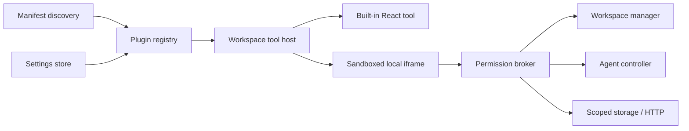

# mxwl plugins

Plugins turn the top-right workspace quadrant into an extensible tool deck. Code Explorer and
Changes use the same `workspaceTools` contribution registry as local plugins, so they can be
enabled, disabled, reordered, and evolved without adding another hard-coded pane.

This is the first version of the plugin API. It deliberately starts with one strong extension
point instead of exposing Electron or the renderer internals.

## Install a local plugin

1. Open **Settings → Plugins → Open folder**.
2. Copy one plugin directory into that folder. A plugin directory must contain
   `mxwl.plugin.json` and its HTML entry file.
3. Select **Reload**, review the requested permissions, and enable the plugin.

Local plugins are disabled on first discovery. The bundled
[`Task Board`](../examples/plugins/task-board/) is a complete example you can copy and modify.
If an enabled plugin changes its requested permissions, mxwl disables it until you review the new
list and explicitly enable it again.

## Manifest

```json
{
  "apiVersion": 1,
  "id": "com.example.tasks",
  "name": "Task Board",
  "version": "1.0.0",
  "description": "Workspace-local task tracking.",
  "author": "Example",
  "permissions": ["workspace:read", "storage", "agent:prompt"],
  "contributes": {
    "workspaceTools": [
      {
        "id": "tasks",
        "title": "Tasks",
        "icon": "tasks",
        "order": 300,
        "entry": "index.html"
      }
    ]
  }
}
```

IDs must be lowercase and globally unique. The `mxwl.*` namespace is reserved. Entries are
relative HTML documents; their scripts, styles, and images can be relative files in the same plugin
directory. Paths and symlinks may not escape that directory. Supported icons are `code`, `diff`,
`tasks`, `git`, `globe`, and `puzzle`.

## Runtime model

There are two plugin tiers:

| Tier | Intended use | Execution |
|---|---|---|
| Built-in | First-party, performance-sensitive tools | Compiled React modules registered through the contribution API |
| Local | Personal and team-specific tools | Dedicated `mxwl-plugin://` resources in a unique-origin, script-only sandboxed iframe |

The lifecycle is:

```text
discover manifest → validate files → show disabled → user reviews permissions
        → enable → mount contributed tab → ready/context messages
        → permission-gated host calls → disable/unmount
```

Only the manifest is read during discovery. Local plugin UI is loaded after enablement. Reloading
the catalog re-reads manifests and entry validation; switching workspaces sends a fresh context.

## Browser bridge

The host sends `ready`, `context`, and `visibility` messages. A plugin calls host methods with a
request/response pair:

```js
const pending = new Map()

function mxwlCall(method, params = {}) {
  const id = `${Date.now()}-${Math.random().toString(36).slice(2)}`
  parent.postMessage({ source: 'mxwl-plugin', type: 'request', id, method, params }, '*')
  return new Promise((resolve, reject) => pending.set(id, { resolve, reject }))
}

addEventListener('message', (event) => {
  const message = event.data
  if (message?.source === 'mxwl-host' && message.type === 'response') {
    const request = pending.get(message.id)
    if (!request) return
    pending.delete(message.id)
    message.error ? request.reject(new Error(message.error)) : request.resolve(message.result)
  }
  if (message?.source === 'mxwl-host' && ['ready', 'context'].includes(message.type)) {
    console.log(message.apiVersion, message.workspace)
  }
})

// Install the listener first, then ask the host for the initial workspace context.
parent.postMessage({ source: 'mxwl-plugin', type: 'ready' }, '*')
```

The host independently checks the plugin identity, enabled state, workspace, method, and declared
permission on every call. A plugin cannot grant itself access by changing its JavaScript.

## Permissions and methods

| Permission | Methods | Notes |
|---|---|---|
| `workspace:read` | `workspace.getContext` | ID, title, host, root, status, issue, branch, dirty state |
| `files:read` | `files.list`, `files.read` | Paths must remain inside the active workspace |
| `files:write` | `files.write` | Writes one text file inside the active workspace |
| `git:read` | `git.status`, `git.changes`, `git.diff`, `git.pullRequestUrl` | Uses the workspace's local/SSH Git adapter |
| `git:write` | `git.stageFile`, `git.unstageFile`, `git.stageHunk`, `git.commit`, `git.push` | Mutates the working tree or remote repository |
| `browser:open` | `browser.open` | Opens an HTTP(S) URL in a workspace browser tab |
| `agent:prompt` | `agent.prompt` | Sends text to the active workspace agent |
| `storage` | `storage.get`, `storage.set` | JSON values, 256 KB total per plugin |
| `network:fetch` | `network.fetch` | HTTP(S), 20 second timeout, 2 MB response limit |

Example calls:

```js
await mxwlCall('files.read', { path: 'package.json' })
await mxwlCall('git.diff', { path: 'src/app.ts' })
await mxwlCall('storage.set', { key: 'view', value: { filter: 'open' } })
await mxwlCall('agent.prompt', { text: 'Implement task PROJ-42 and run its tests.' })
await mxwlCall('network.fetch', {
  url: 'https://tasks.example.test/api/me',
  headers: { Authorization: 'Bearer …' }
})
```

`network.fetch` is intentionally broad once granted. A plugin with that permission can talk to
public or private HTTP services and can transmit data it can read through other permissions. Only
enable plugins you trust and treat permission changes like code changes.

## Security boundary

Local plugin frames have no Node.js, Electron, preload, parent-origin, top-navigation, popup, form,
or direct network privileges. Each plugin ID receives a distinct protocol origin, every bridge
message is checked against it, and the iframe only receives scripts plus its isolated plugin origin.
The dedicated protocol also attaches a restrictive Content Security Policy. JavaScript must be a
relative plugin asset such as `<script src="./index.js"></script>`; inline and remote scripts are
blocked. Images are limited to plugin assets or data URLs, and all external API traffic requires the
explicit `network:fetch` bridge permission. The bridge rejects every message after a frame leaves
its assigned plugin origin.

This boundary limits accidents and ambient authority; it does not make untrusted code safe after
you grant it sensitive capabilities. Review a plugin's HTML and manifest before enabling it.

## Backport of Code and Changes

The original top-right tabs now publish these built-in manifests:

| Plugin | Contribution | Default | Implementation |
|---|---|---|---|
| `mxwl.code` | `code` | Enabled | Existing FileTree, SearchPanel, and Monaco editor |
| `mxwl.changes` | `changes` | Enabled | Existing changed-file inbox, DiffViewer, and Git actions |

The renderer no longer assumes those tabs exist. It asks the registry for enabled workspace tools,
sorts them by `order`, mounts the corresponding built-in or sandboxed renderer, and remembers the
last selected contribution. The old `code`/`changes` tab preference migrates automatically.

This is a behavioral backport, not a rewrite: the mature native implementations remain compiled
for performance and type safety, while registration, enablement, selection, persistence, and
lifecycle use the plugin system.

## Architecture and roadmap



The next useful contribution points can reuse the same registry and broker:

- `commands`: command-palette actions with declared placement and keybinding hints.
- `statusItems`: compact workspace/tab indicators.
- `settings`: schema-driven plugin configuration without exposing the host settings object.
- `taskProviders`: ticket search, metadata, and launch hooks.
- `scmProviders`: pull-request metadata and provider actions above the common Git layer.

Those are intentionally not accepted by API version 1 yet. Unknown capabilities fail validation so
a plugin cannot appear partially functional. Future incompatible contracts should increment
`apiVersion`; additive host methods can stay on version 1 when they remain permission-gated.
