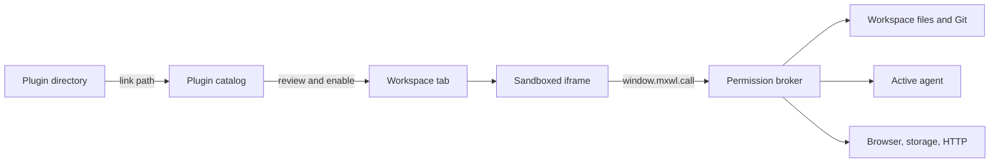

An mxwl plugin is a local web application that adds one or more tabs to the top-right workspace
tool deck. It lives in its own directory, is linked into mxwl by filesystem path, and talks to the
active workspace through a small permission-gated browser SDK.

You do not need Electron, React, a package registry, or an mxwl source checkout. A useful plugin can
be three files:

```text
my-plugin/
├── mxwl.plugin.json
├── index.html
└── index.js
```

This guide takes that directory from zero to a running plugin. The companion references go deeper:

| Guide                                                             | Use it for                                                                 |
| ----------------------------------------------------------------- | -------------------------------------------------------------------------- |
| **This page**                                                     | Mental model, first plugin, lifecycle, design guidance                     |
| [API reference](/docs/plugin-api/)                                  | Every manifest field, SDK function, method, result, and limit              |
| [Recipes](/docs/plugin-recipes/)                                    | File readers, task tools, Git views, HTTP integrations, and state patterns |
| [Testing and distribution](/docs/plugin-testing/)                   | Dev loop, automated tests, packaging, versioning, troubleshooting          |
| [Security model](/docs/plugin-security/)                            | Sandbox, CSP, permission review, secrets, and threat model                 |
| [`build-mxwl-plugin` skill](https://github.com/KerryRitter/mxwl-editor/blob/main/skills/build-mxwl-plugin/SKILL.md) | Agent workflow that reads these docs and builds the plugin externally      |

The API described here is plugin API version 1.

## What plugins can build

Version 1 contributes full workspace tools: tabs beside **Code** and **Changes**. Good fits include:

- a branch brief or local artifact reader;
- a task board backed by Jira, Linear, GitHub, or an internal API;
- a source-control or pull-request dashboard;
- a runbook, deploy, test, or QA evidence surface;
- a workspace-local notes, checklist, or handoff tool;
- a company-specific workflow that should not live in mxwl itself.

A workspace tool can read context, inspect or write workspace files, inspect or mutate Git, open a
workspace browser tab, hand a prompt to the active agent, store JSON state, and make brokered HTTP
requests. It only receives capabilities declared in its manifest and approved by the user.

Version 1 does not contribute commands, status-bar items, settings forms, terminal providers, task
providers, or SCM providers. Those are planned extension points, not silently accepted manifest
fields.

## Runtime in one picture



The important boundaries are:

1. **The plugin stays external.** mxwl remembers its canonical directory and serves files from that
   location. It does not copy the plugin into the application.
2. **The UI is a browser app.** It runs in a sandboxed iframe at a plugin-specific
   `mxwl-plugin://<plugin-id>` origin. There is no Node.js or Electron API.
3. **The bridge is the authority.** JavaScript cannot gain a capability merely by calling a method.
   The host checks the plugin ID, enabled state, active workspace, method, and approved permission on
   every request.
4. **The workspace is contextual.** The same tool is mounted for a workspace and receives fresh
   context as branch, dirty state, connection state, or other exposed metadata changes.

## Build the smallest plugin

Create a directory anywhere on the machine. Keeping plugins in their own Git repositories works
well because mxwl links them in place.

### 1. Add the manifest

Create `mxwl.plugin.json`:

```json
{
  "apiVersion": 1,
  "id": "com.example.workspace-note",
  "name": "Workspace Note",
  "version": "1.0.0",
  "description": "Reads a workspace note and can hand it to the active agent.",
  "author": "Example Team",
  "permissions": ["workspace:read", "files:read", "agent:prompt"],
  "contributes": {
    "workspaceTools": [
      {
        "id": "note",
        "title": "Note",
        "icon": "book",
        "order": 300,
        "entry": "index.html"
      }
    ]
  }
}
```

The `id` is the durable identity of the plugin. Use a reverse-domain or organization-prefixed name
you control. Changing it later creates a different plugin, a different origin, and a different
storage namespace.

Only request permissions the current version actually uses. Permission changes intentionally
disable an already-enabled plugin until the user reviews and enables it again.

### 2. Add the page

Create `index.html`:

```html
<!doctype html>
<html lang="en">
  <head>
    <meta charset="UTF-8" />
    <meta name="viewport" content="width=device-width, initial-scale=1" />
    <title>Workspace Note</title>
    <link rel="stylesheet" href="./styles.css" />
  </head>
  <body>
    <header>
      <strong>Workspace Note</strong>
      <span id="workspace">Waiting for a workspace…</span>
    </header>
    <main>
      <pre id="note">Loading…</pre>
      <button id="ask" type="button" disabled>Ask agent to act on this</button>
      <p id="error" role="alert"></p>
    </main>

    <!-- The host serves this file inside every plugin origin. Load it first. -->
    <script src="/__mxwl/sdk/v1.js"></script>
    <script src="./index.js"></script>
  </body>
</html>
```

Scripts must be external files. The sandbox's Content Security Policy blocks inline and remote
JavaScript. Local styles may be linked or inline.

Create `styles.css`:

```css
:root {
  color-scheme: dark;
  font:
    12px/1.5 Inter,
    ui-sans-serif,
    system-ui,
    sans-serif;
  background: #09090b;
  color: #e4e4e7;
}

body {
  margin: 0;
  padding: 16px;
}
header {
  display: flex;
  justify-content: space-between;
  gap: 16px;
  color: #a78bfa;
}
pre {
  min-height: 160px;
  white-space: pre-wrap;
  color: #d4d4d8;
}
button {
  padding: 7px 10px;
  border: 1px solid #52525b;
  border-radius: 6px;
  background: #27272a;
  color: white;
}
#error {
  color: #fca5a5;
}
```

### 3. Use the SDK

Create `index.js`:

```js
let currentWorkspace = null;
let currentNote = "";
let loadGeneration = 0;

const workspaceLabel = document.querySelector("#workspace");
const note = document.querySelector("#note");
const ask = document.querySelector("#ask");
const error = document.querySelector("#error");

function showError(reason) {
  error.textContent = reason instanceof Error ? reason.message : String(reason);
}

async function load(workspace) {
  const generation = ++loadGeneration;
  currentWorkspace = workspace;
  workspaceLabel.textContent = workspace.title;
  error.textContent = "";
  ask.disabled = true;

  try {
    const result = await window.mxwl.call("files.read", {
      path: "WORKSPACE.md",
    });
    if (generation !== loadGeneration) return;
    if (result.encoding !== "utf8") throw new Error("WORKSPACE.md is not text");
    currentNote = result.content;
    note.textContent = currentNote;
    ask.disabled = false;
  } catch (reason) {
    if (generation !== loadGeneration) return;
    currentNote = "";
    note.textContent = "No readable WORKSPACE.md in this workspace.";
    showError(reason);
  }
}

window.mxwl.onContext(({ workspace }) => void load(workspace));

ask.addEventListener("click", () => {
  if (!currentWorkspace || !currentNote) return;
  ask.disabled = true;
  window.mxwl
    .call("agent.prompt", {
      text: `Use this workspace note as instructions:\n\n${currentNote}`,
    })
    .catch(showError)
    .finally(() => {
      ask.disabled = false;
    });
});
```

The generation check prevents an older asynchronous read from overwriting a newer workspace
context. Use this pattern whenever a context change starts async work.

### 4. Link and enable it

1. Open **Settings → Plugins**.
2. Paste the plugin directory—or its exact `mxwl.plugin.json` path—into **Install path**. `~` and
   `~/…` are accepted. You can also choose **Browse…**.
3. Select **Install path**. The plugin appears disabled.
4. Review its requested permissions and enable it.
5. Open the new **Note** tab in the top-right tool deck.

The path is saved, so future launches reconnect to the same directory. **Unlink** forgets the path
without deleting source files. Plugin storage is also left intact.

### 5. Iterate

Edit the files in the external directory, then choose **Settings → Plugins → Reload**. Reloading:

- re-reads every linked manifest;
- validates each entry again;
- increments the plugin resource revision;
- remounts the tool with uncached local assets;
- detects permission changes and requires reapproval.

You do not need to rebuild or reinstall mxwl. If your plugin has a build step, point mxwl at the
output directory containing `mxwl.plugin.json`, not at source files the browser cannot execute.

## Directory layout and assets

A larger plugin might look like this:

```text
mxwl-plugin-acme/
├── mxwl.plugin.json
├── dist/
│   ├── tasks.html
│   ├── reviews.html
│   ├── app.js
│   ├── app.css
│   ├── logo.svg
│   └── font.woff2
├── src/
├── test/
├── package.json
└── README.md
```

The manifest can contribute multiple tools:

```json
{
  "apiVersion": 1,
  "id": "com.acme.delivery",
  "name": "Acme Delivery",
  "version": "2.1.0",
  "permissions": ["workspace:read", "git:read", "network:fetch", "storage"],
  "contributes": {
    "workspaceTools": [
      {
        "id": "tasks",
        "title": "Tasks",
        "icon": "tasks",
        "order": 310,
        "entry": "dist/tasks.html"
      },
      {
        "id": "reviews",
        "title": "Reviews",
        "icon": "git",
        "order": 320,
        "entry": "dist/reviews.html"
      }
    ]
  }
}
```

Each contribution gets its own iframe and `contributionId`, but contributions from one plugin share
the same origin, permissions, and plugin storage. Namespace storage keys by contribution if their
state should not overlap.

Runtime assets must stay under the plugin directory. Symlinks that resolve outside it are rejected.
Supported web asset MIME types are HTML, JavaScript/MJS, CSS, JSON, SVG, PNG, JPEG, WebP, and WOFF2;
other extensions are served as `application/octet-stream`. Each served plugin asset is limited to
2 MiB, so bundle thoughtfully and split large files.

## The SDK and lifecycle

The versioned SDK installs a frozen `window.mxwl` object:

```ts
interface MxwlPluginClient {
  readonly apiVersion: 1;
  call<T = unknown>(
    method: string,
    params?: Record<string, unknown>,
  ): Promise<T>;
  getContext(): MxwlPluginContext | null;
  isVisible(): boolean;
  onContext(listener: (context: MxwlPluginContext) => void): () => void;
  onVisibility(listener: (visible: boolean) => void): () => void;
}
```

Standalone TypeScript declarations live at
[`sdk/mxwl-plugin-sdk.d.ts`](https://github.com/KerryRitter/mxwl-editor/blob/main/sdk/mxwl-plugin-sdk.d.ts). Copy that file into an external plugin,
publish your own package containing it, or reference it from a JavaScript project:

```js
// @ts-check
/// <reference path="./mxwl-plugin-sdk.d.ts" />
```

The lifecycle is event-oriented:

```text
iframe loads
  → SDK announces ready
  → host sends plugin + contribution + workspace context
  → onContext listeners run
  → host may send updated context many times
  → host sends visibility changes as tabs/workspaces change
  → Reload, disable, permission change, or unlink removes/remounts the frame
```

Important consequences:

- `getContext()` can be `null` until the first host message. `onContext()` is the safest startup
  hook and replays the latest context to late subscribers.
- Context is not a one-time initialization event. Make loading idempotent and race-safe.
- An enabled tool can remain mounted while its tab is hidden. Pause polling, animation, and heavy
  work when `onVisibility(false)` fires; refresh stale data when it becomes visible again.
- Do not assume page memory survives reload, disable/enable, application restart, or a future host
  optimization. Persist durable UI state through `storage.set`.
- Every `call()` has a 30-second SDK timeout. A rejected client promise does not guarantee that a
  host-side operation was cancelled.

Always retain and call subscription cleanup functions when a framework mounts and unmounts a
component repeatedly:

```js
const stopContext = window.mxwl.onContext(renderContext);
const stopVisibility = window.mxwl.onVisibility(setVisible);

// During your framework's unmount/dispose hook:
stopContext();
stopVisibility();
```

## Context and workspace identity

An SDK context has two layers:

```js
{
  apiVersion: 1,
  pluginId: 'com.example.workspace-note',
  contributionId: 'note',
  workspace: {
    id: 'runtime-workspace-id',
    title: 'PROJ-42',
    remotePath: '/workspaces/PROJ-42',
    hostId: 'local',
    hostLabel: 'This machine',
    projectId: 'project-id',
    projectLabel: 'My app',
    locationId: 'project-location-id',
    browserProfileId: 'qa',
    status: 'connected',
    issueKey: 'PROJ-42',
    branch: 'feature/PROJ-42',
    dirty: true
  }
}
```

Context also includes project/location/profile IDs and display labels. These fields are
additive in API v1; unassigned folders have null project/location/profile IDs. Plugins
never receive project secrets. Project-level tool disabling is enforced both in the deck
and on every bridge call; it cannot override global permissions.

Use `workspace.id` as the runtime identity. For storage that survives closing/reopening a
workspace, namespace by project/location/profile and path rather than the ephemeral runtime ID. `remotePath` may describe a local
or SSH-backed workspace and should be presented as information, not passed to `files.*`; file API
paths are always workspace-relative.

Fields such as `issueKey`, `branch`, and `dirty` are optional or nullable. A plugin must still work
for a non-Git directory and for hosts without issue-key derivation.

## State: memory, plugin storage, and workspace files

Choose state based on ownership:

| State                                     | Best home                              | Why                                               |
| ----------------------------------------- | -------------------------------------- | ------------------------------------------------- |
| Selection, expanded sections, last filter | Plugin storage                         | Private UI state; JSON; survives remount/restart  |
| Project configuration shared through Git  | Workspace file                         | Visible, reviewable, portable with the repository |
| Derived API/file data                     | Memory plus refresh                    | Rebuildable; avoids stale duplicated state        |
| Credentials                               | Prefer an existing secure service flow | Plugin storage is not a secret vault              |

Storage is scoped to the plugin ID across the machine, not automatically to a workspace or
contribution. Create explicit keys:

```js
const { contributionId, workspace } = window.mxwl.getContext();
const key = `${contributionId}:filters:${workspace.id}`;

await window.mxwl.call("storage.set", {
  key,
  value: { owner: "me", state: "open" },
});
```

The total serialized storage budget is 256 KiB per plugin. It is appropriate for settings and
small caches, not databases, logs, documents, access-token collections, or binary data.

## Permissions as product design

Permissions are part of the install experience. A focused artifact reader that requests
`workspace:read` and `files:read` is easier to trust than one asking for every capability.

| Permission       | Capability                                                        |
| ---------------- | ----------------------------------------------------------------- |
| `workspace:read` | Read current workspace metadata                                   |
| `files:read`     | List directories/files and read file content inside the workspace |
| `files:write`    | Write text files inside the workspace                             |
| `git:read`       | Read status, changed paths, diffs, and pull-request URL           |
| `git:write`      | Stage, unstage, commit, and push                                  |
| `browser:open`   | Open an HTTP(S) URL as a workspace browser tab                    |
| `agent:prompt`   | Send work to the active workspace agent                           |
| `storage`        | Read and write plugin-scoped JSON state                           |
| `network:fetch`  | Send HTTP(S) requests through the host                            |

The host treats an exact permission set as the approval grant. Adding, removing, or renaming a
permission changes that set and disables the plugin until the user reviews it. Version and code
changes alone do not trigger a new permission review, so plugin distribution still depends on
trusting the directory and its update process.

See the [API reference](/docs/plugin-api/) for method-to-permission mapping and the
[security guide](/docs/plugin-security/) before combining file access with HTTP or write operations.

## Build for the workspace tool deck

Plugins share a dense quadrant with code review tools. Treat the frame as a responsive panel, not a
full browser window:

- render well from roughly 320 px wide to a maximized desktop pane;
- use the entire frame rather than fixed page dimensions;
- keep the primary action and current workspace obvious;
- use compact typography, progressive detail, and keyboard-friendly controls;
- expose loading, empty, disconnected, stale, and error states;
- never rely on color alone for status;
- escape untrusted text by assigning `textContent`, not `innerHTML`;
- debounce search and bound file/API discovery;
- preserve the user's scroll, selection, and filters when refreshing data;
- stop background work while hidden.

mxwl supplies no shared component library to external plugins in API v1. Plain HTML works well;
React, Vue, Svelte, Lit, or another browser framework also works if it is bundled into local files
that satisfy the sandbox and per-asset limit.

## Learn from the examples

The in-repository [`Task Board`](https://github.com/KerryRitter/mxwl-editor/blob/main/examples/plugins/task-board) is intentionally small. It shows:

- a complete manifest;
- SDK loading and context subscription;
- workspace-keyed storage;
- DOM rendering without a build step;
- handing a task to the active agent.

A standalone artifact-reader plugin can detect focused-branch artifacts such as `QA_PREP.md`
under a tool-owned directory (for example `.agent-artifacts/local/<TICKET>/`), render a rich
reading experience, and use bounded hidden-directory discovery. See the generic
[artifact-reader recipe](/docs/plugin-recipes/) to build one outside the mxwl codebase.

## Architecture for host contributors

The built-in Code Explorer and Changes tools publish the same workspace-tool registrations as
linked plugins, but their renderers remain compiled React code for performance and type safety:

| Plugin         | Contribution | Default order | Renderer                                         |
| -------------- | ------------ | ------------: | ------------------------------------------------ |
| `mxwl.code`    | `code`       |           100 | Native FileTree, SearchPanel, CodeMirror 6 editor      |
| `mxwl.changes` | `changes`    |           200 | Native changed-file inbox and CodeMirror 6 diff viewer |

The renderer asks the registry for enabled contributions, sorts by `order` and title, remembers the
selected contribution per workspace, and chooses a native renderer or an external iframe. This
keeps registration and enablement uniform without forcing performance-sensitive built-ins through
the iframe bridge.

Potential future contribution points include `commands`, `statusItems`, schema-driven `settings`,
`taskProviders`, and `scmProviders`. API v1 supports only `workspaceTools`; write against the
documented contract and feature-detect future SDK additions.

## Next steps

1. Copy the [Task Board example](https://github.com/KerryRitter/mxwl-editor/blob/main/examples/plugins/task-board), use the three-file starter above,
   or invoke `$build-mxwl-plugin` after installing the repository's
   [`build-mxwl-plugin` skill](https://github.com/KerryRitter/mxwl-editor/blob/main/skills/build-mxwl-plugin/SKILL.md).
2. Keep the first permission set narrow and implement one excellent workspace workflow.
3. Use the [API reference](/docs/plugin-api/) while wiring host calls.
4. Apply the race, visibility, storage, and network patterns in [Recipes](/docs/plugin-recipes/).
5. Add the checks in [Testing and distribution](/docs/plugin-testing/) before sharing the path or
   repository with other users.
